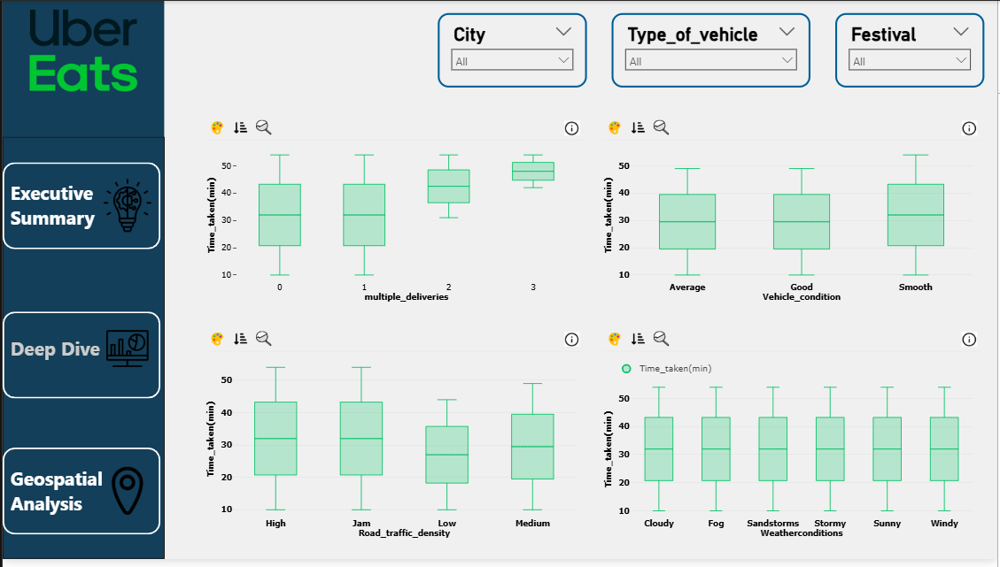

# Food Delivery Performance Analysis

## Overview
This project is an end-to-end data analysis of food delivery performance using a dataset from Kaggle. The goal was to clean, explore, and visualize the data to uncover the key factors that influence delivery times. The final output is an interactive, multi-page Power BI dashboard designed for operational and strategic decision-making.

## Dashboard Showcase
Here is a preview of the main "Executive Summary" page of the final dashboard.

## Key Questions Answered
The dashboard was built to answer critical business questions, such as:
- What are the busiest days of the week and hours of the day?
- What is the single biggest factor causing delivery delays (traffic, weather, etc.)?
- How does the delivery vehicle condition or having multiple deliveries impact performance?
- Where are the geographic hotspots for our delivery operations?

## Tech Stack
- **Python:** for data cleaning, processing, and exploratory data analysis (EDA).
  - *Libraries:* Pandas, Matplotlib, Seaborn
- **Power BI:** for creating the final interactive dashboard and data modeling.
  - *Languages:* DAX

## Project Structure
- **/data:** Contains the original and cleaned CSV files.
- **/notebooks:** Includes the Jupyter Notebook with the full Python EDA.
- **/powerbi:** The final Power BI `.pbix` report file.
- **/images:** Screenshots used in this README.

## How to Use
1. Download the repository.
2. The cleaned data is available in `/data/cleaned_delivery_data.csv`.
3. The full exploratory data analysis can be viewed in the Jupyter Notebook located in the `/notebooks` folder.
4. The interactive dashboard can be explored by opening the `.pbix` file in the `/powerbi` folder.
